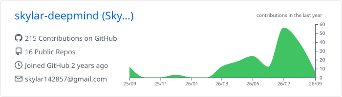
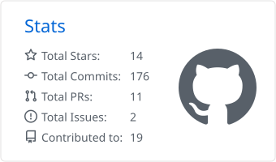

# Hi, I'm skylar-deepmind 👋

Welcome to my corner of GitHub!

I'm a student learning and practicing **web development**, with a focus on turning ideas into things people can actually use.

To me, code is more than a way to implement features or solve technical problems. It is also a medium for expressing ideas, shaping designs, and transforming imagination into real experiences.

I hope to keep learning through building and create thoughtful tools that can be useful to more people.

## 🚧 Currently Building

### [Naoii](https://github.com/skylar-deepmind/Naoii)

My current project and learning playground—where I experiment, iterate, and turn ideas into working features.

## 🌱 What I'm Exploring

* Building practical and thoughtful web applications
* Turning early ideas into clear and usable products
* Learning through experimentation and real-world projects
* Exploring the connection between technology, design, and people
* Creating tools that make something easier, better, or more enjoyable

## 🎧 Beyond Code

When I'm away from the keyboard, I enjoy:

* Listening to music
* Learning about economics and history
* Reading books across different subjects and genres

---

> “Write code. Shape ideas. Build something useful.”

Thanks for stopping by. Feel free to explore my work and follow along as I continue learning and building.

## 📊 GitHub Activity

  

  

